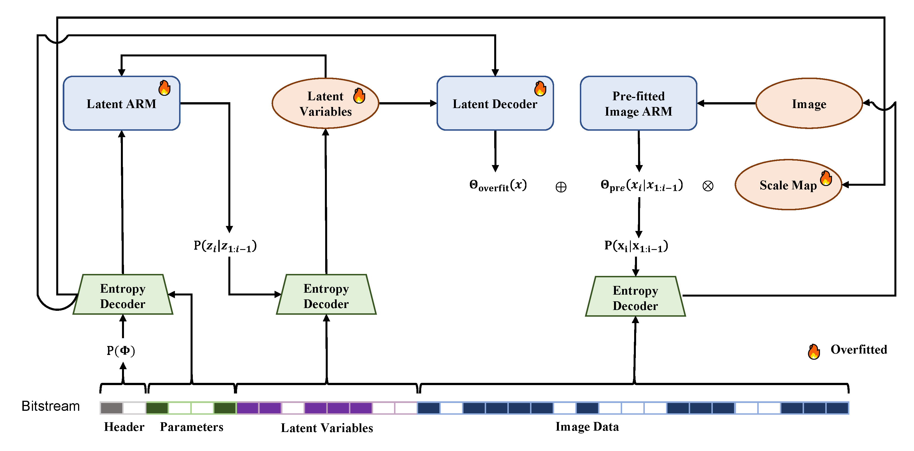

# FNLIC

### <p align="center"> Fitted Neural Lossless Image Compression</p>
####  <p align="center"> CVPR 2025 </p>
####  <p align="center"> Zhe Zhang, Zhenzhong Chen, Shan Liu</p>



## Citation

```
@InProceedings{zhang2025fitted,
    author    = {Zhang, Zhe and Chen, Zhenzhong and Liu, Shan},
    title     = {Fitted Neural Lossless Image Compression},
    booktitle = {Proceedings of the IEEE/CVF Conference on Computer Vision and Pattern Recognition (CVPR)},
    month     = {June},
    year      = {2025},
}
```

## Acknowledgments

Special thanks to:
- [Cool-Chic](https://github.com/Orange-OpenSource/Cool-Chic) for the fundenmental Cool-Chic implementation.
- [FSAR](https://github.com/alipay/Finite_State_Autoregressive_Entropy_Coding) for the multi-table ANS implementation.

