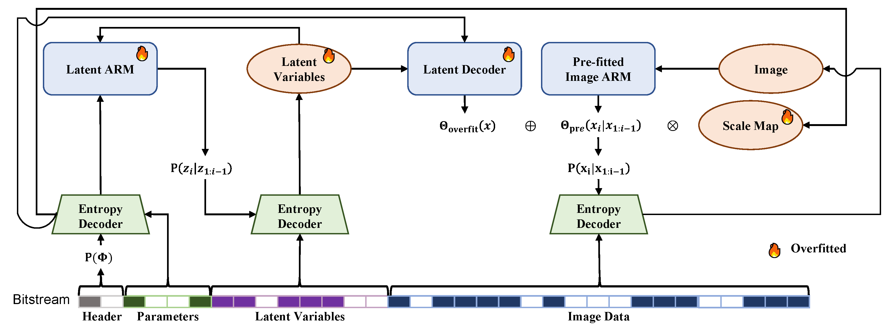

# FNLIC (Fitted Neural Lossless Image Compression)

This repository contains code for reproducing results in the CVPR2025 paper *Fitted Neural Lossless Image Compression*.

FNLIC paper links: [cvf]</p>



## Setup
The code is implemented in Ubuntu 20.04. It may not work on other platforms. `Python>=3.10` is required. Use the following command to install the dependencies:
```
pip install -r requirements.txt
cd src
python setup.py install
```


## Encoding and Decoding

To encode an image, use the following command:
```
python encode.py [options]
```
Use `python encode.py -h` to see the detailed options.

To decode an image, use the following command:
```
python decode.py [options]
```
Use `python decode.py -h` to see the detailed options.

## Training the Pre-fitter
The pre-trained fitter is provided in the `weight` folder.

To train a pre-fitter, use the following command:
```
python train_fitter.py
```
Modify the hyper-parameters in `train_fitter.py` to fit your needs.

## Reproducing the Results

Datasets for evaluation, overfitted models , and encoded bitstreams are available [here](https://drive.google.com/drive/folders/1dBsvHzIfb4W1ePYVkEmtmE4PYXYtsesf?usp=sharing). Download and extract the directories to the root of the project.

Nerual codecs face cross-device consistency issues, so the bitstreams may not be decoded correctly on your device. Therefore, we provide the overfitted models. To validate the performance, execute the  `check_model.sh` file with

```
./check_model.sh <gpus> <dataset_name> <max_tasks_per_gpu>
```
where `<gpus>` is the comma-seperated gpu ids, `<dataset_name>` is the name of the dataset, and `<max_tasks_per_gpu>` is the maximum number of tasks per GPU. Valid dataset names are `kodak`, `clic2024`, `div2k`, `histo24`, `loveda24`, and `doc24`.


We also provide the encoded bitstreams encoded with Nvidia GTX 1080ti for evaluation. To validate the performance, execute the  `check_bitstream.sh` file with

```
./check_bitstream.sh <gpus> <dataset_name> <max_tasks_per_gpu>
```
with the same arguments as above.

To overfit, encode and decode the images, use the following command:
```
python test_overfit_enc_dec.py [options]
```
Use `python test_overfit_enc_dec.py -h` to see the detailed options.

To evaluate the inference time, use the following command:
```
python test_inf_time.py [options]
```
Use `python test_inf_time.py -h` to see the detailed options.

## Citation

```
@InProceedings{zhang2025fitted,
    author    = {Zhang, Zhe and Chen, Zhenzhong and Liu, Shan},
    title     = {Fitted Neural Lossless Image Compression},
    booktitle = {Proceedings of the IEEE/CVF Conference on Computer Vision and Pattern Recognition (CVPR)},
    month     = {June},
    year      = {2025},
}
```

## Acknowledgments

Special thanks to:
- [Cool-Chic](https://github.com/Orange-OpenSource/Cool-Chic) for the fundamental Cool-Chic implementation.
- [FSAR](https://github.com/alipay/Finite_State_Autoregressive_Entropy_Coding) for the multi-table ANS implementation.

